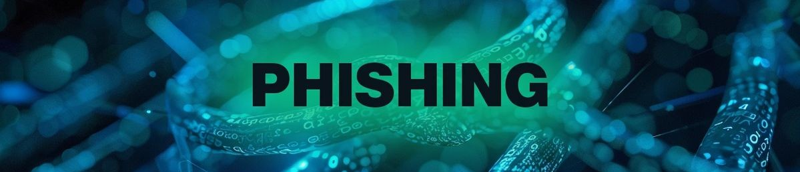

# Phishing-campaign-for-awareness
Making users  aware of the dangers of phishing through awareness

---
## What is Phishing?
**Phishing** is a form of social engineering and a scam where attackers deceive people into revealing sensitive information or installing malware such as viruses, worms, adware, or ransomware.It is the most common cyber attack, in addition phishing is a fast evolving area, with every advancement of technology so does the sophistication of phishing attacks become thats why this topic is relevant to this moment.

